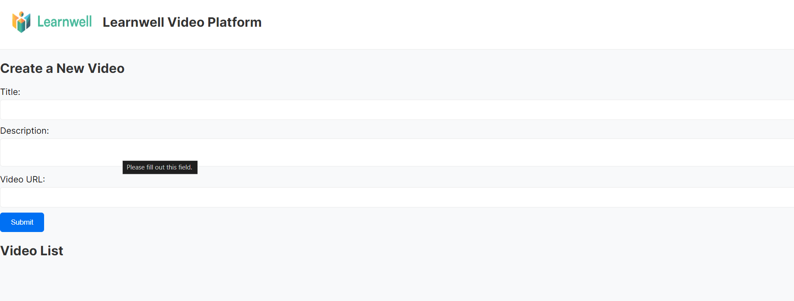

# Learnwell Video Platform

Learnwell Video Platform is a simple web application that allows users to create, comment on, and watch educational videos. The application interacts with a backend API to provide a seamless and engaging experience for users.

## Features

- Show a list of videos and allow users to select a video from the list.
- Allow users to create a new video object with a title, description, and video URL.
- Allow users to comment on a video and view comments from other users.
- Open the videos in full screen with full playback functionality.
- Include options for adjusting playback speed and volume.

## Technologies Used

- Frontend: React, Next.js, TypeScript
- Backend: Axios for API integration

## Getting Started

### Prerequisites

- Node.js and npm installed on your machine.

### Installation

1. Clone the repository:

   ```bash
   git clone https://github.com/yourusername/learnwell-video-platform.git
   cd learnwell-video-platform
   ```

2. Install dependencies:

   ```bash
   npm install
   ```

### Running the Application

1. Start the development server:

   ```bash
   npm run dev
   ```

2. Open your browser and navigate to `http://localhost:3000`.

### Configuration

Ensure the `config.ts` file has the correct backend API base URL:

```typescript
// src/config.ts
export const BACKEND_API = 'https://take-home-assessment-423502.uc.r.appspot.com/api';
```

### API Endpoints

- **Create Video**: `POST /api/videos`
- **Get Videos**: `GET /api/videos?user_id={user_id}`
- **Get Single Video**: `GET /api/videos/{id}`
- **Get Video Comments**: `GET /api/videos/{id}/comments`
- **Post Comment**: `POST /api/videos/{id}/comments`

### Screenshots


### Contact

For any questions, please contact [your email].
